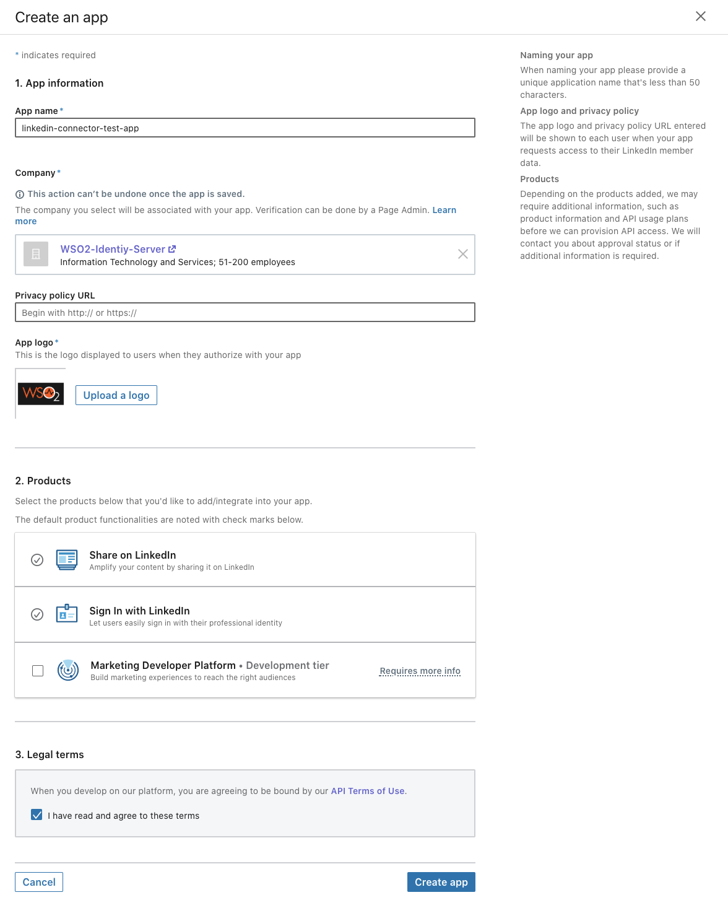
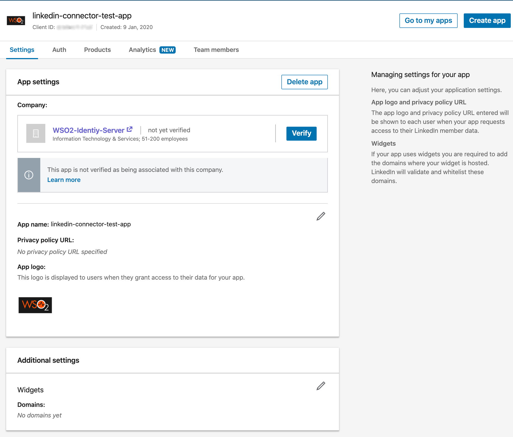
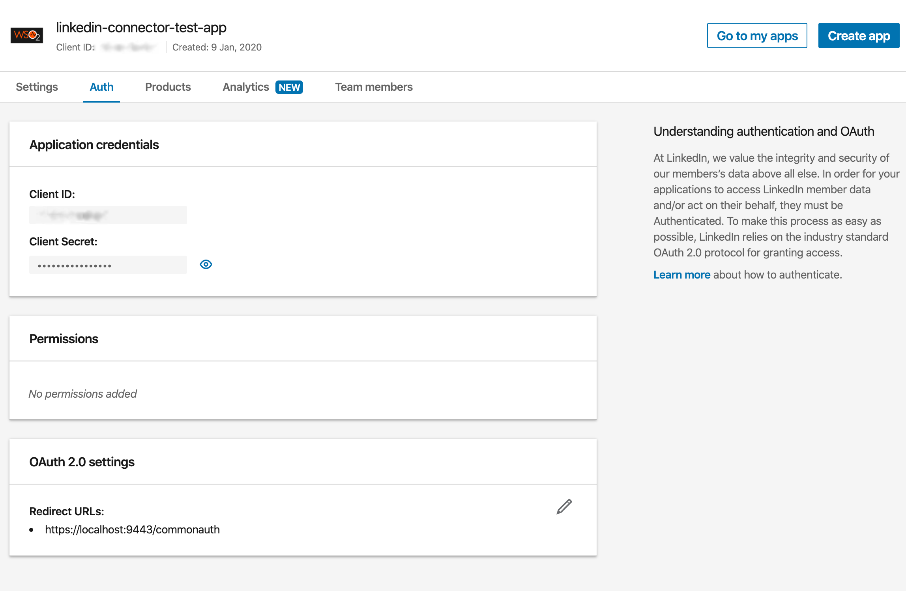
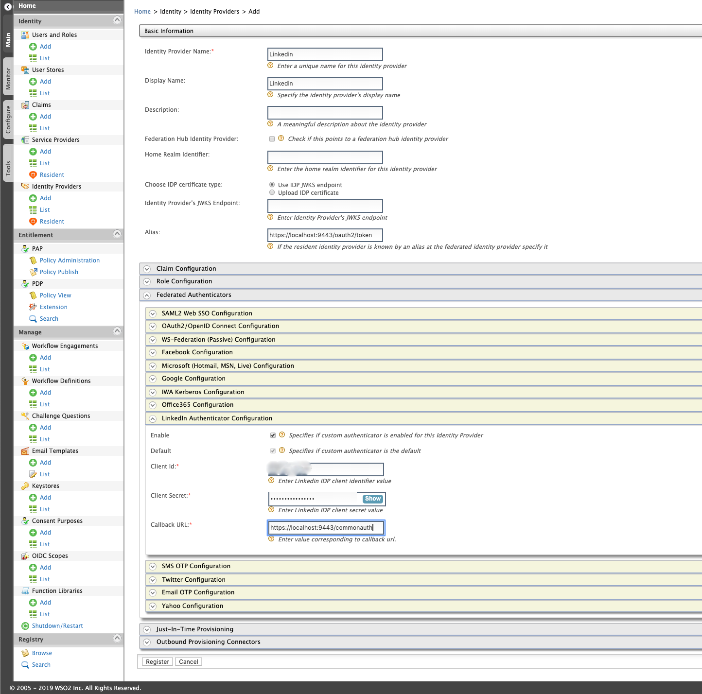
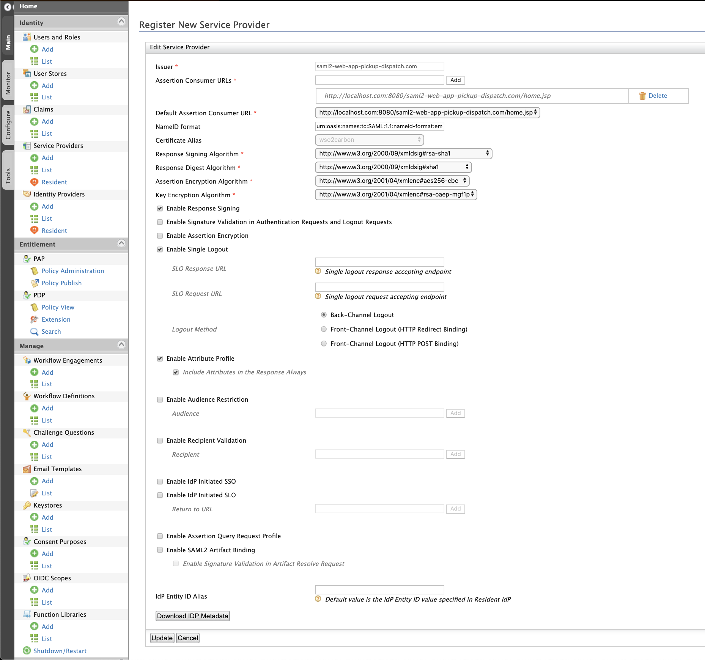
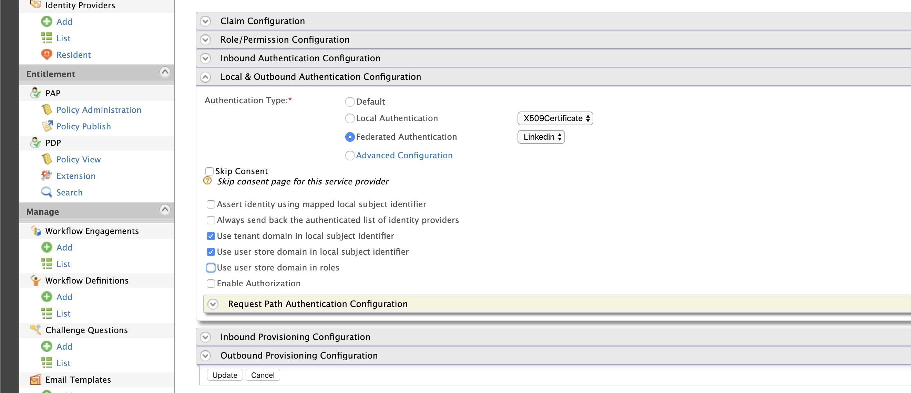
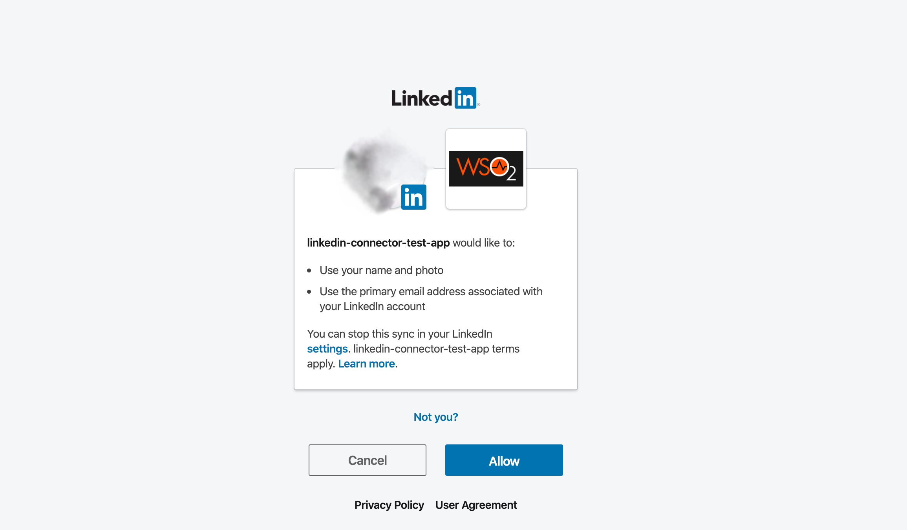
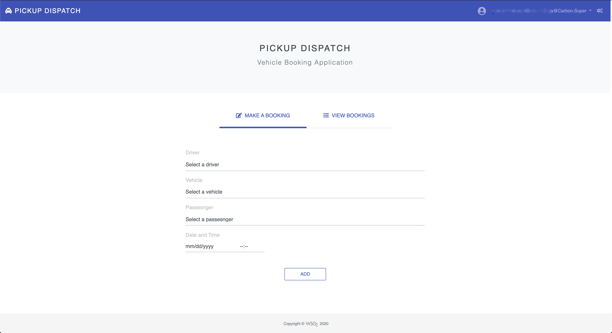

# Configuring LinkedIn Authenticator

This page provides instructions on how to configure the LinkedIn 
authenticator and the WSO2 Identity Server using a sample app to 
demonstrate authentication.

> This authenticator has been tested with LinkedIn API version 2.0. The LinkedIn Authenticator is supported from WSO2 
>Identity Server 5.9.0 onwards.

Follow the steps given below to set this up.

* [Step 1 - Configure the LinkedIn App](#step-1---configure-the-linkedin-app)
* [Step 2 - Deploy the Pickup Dispatch Sample Web App](#step-2---deploy-the-pickup-dispatch-sample-web-app)
* [Step 3 - Configure the Identity Provider (IdP)](#step-3---configure-the-identity-provider-idp)
* [Step 4 - Configure the Service Provider](#step-4---configure-the-service-provider)
* [Step 5 - Configure Claims](#step-5---configure-claims)
* [Step 6 - Configure Requested Claims for Pickup Dispatch Sample Web App](#step-6---configure-requested-claims-for-pickup-dispatch-sample-web-app)
* [Step 7 - Test the Sample Application](#step-7---test-the-sample-application)

## Step 1 - Configure the LinkedIn App

1. Place the authenticator.jar file into the 
`<IS_HOME>/repository/components/dropins` directory. 
You can download the .jar file 
(`org.wso2.carbon.extension.identity.authenticator.linkedin.connector-x.x.x`) 
from the [WSO2 Store](https://store.wso2.com/store/assets/isconnector/list?q=%22_default%22%3A%22LinkedIn%22). 
Next, start or restart the WSO2 Identity Server. 
    > :information_source: If you want to upgrade the LinkedIn (.jar) in your existing Identity Server pack, 
please refer [upgrade instructions](https://docs.wso2.com/display/ISCONNECTORS/Upgrading+an+Authenticator).
 
 2. Create a new application as described below.
 
    a. Navigate to the following URL: `https://www.linkedin.com/developer/apps/new`
    
    b. Enter the required details.
    
        * App Name and Company details. The company should have a LinkedIn page.
        * Upload an image that you wish to use as the company logo.
        * Select the checkbox to agree to the LinkedIn terms and conditions.
    c. Click on **Create App**. You will be redirect to a page with **Settings** for the created application. 
    
    
    
    
    
    d. Navigate to the **Auth** tab where you can see the **Client ID** and
     **Client Secret**.
     
    e. Enter the **Redirect URL** under the **OAuth 2.0 settings** as the following format and click on **Update
    **. `https://{hostname}:{port}/commonauth`. The default redirect URL in WSO2 Identity Server is `https
    ://localhost:9443/commonauth`.
    
    
    
    f. Copy the **Client ID** and **Client Secret** from the resulting page.
    
## Step 2 - Deploy the Pickup Dispatch Sample Web App

The next step is to deploy the Pickup Dispatch sample web app in order to use it in this scenario.

To configure this, see [saml2-web-app-pickup-dispatch 
webapp](https://is.docs.wso2.com/en/5.9.0/learn/deploying-the-sample-app/#deploying-the-saml2-web-app-pickup-dispatch-webapp).

## Step 3 - Configure the Identity Provider (IdP)

Next, add a new identity provider in WSO2 Identity Server, which was started in step 01 by [adding a new identity 
provider](https://is.docs.wso2.com/en/5.9.0/learn/adding-and-configuring-an-identity-provider/#adding-and-configuring-an-identity-provider).

1. Log in to the [Management Console](https://is.docs.wso2.com/en/5.9.0/setup/getting-started-with-the-management-console/) 
as an administrator.

2. In the **Identity Providers** section under the **Main** tab of the management console, click **Add**.

3. Enter a suitable name as the **Identity Provider Name** (e.g., LinkedIn).
    >As our resident Identity Provider is
 WSO2 IS, the Alias will appear as follows - `https://(host-name):(port)/oauth2/token`

4. Optionally, you can add the LinkedIn public certificate by uploading it. You can do this by selecting the **Upload
 IDP certificate** option from **Choose IDP certificate type** and click on the **Choose file** button next to the
  **Identity Provider Public Certificate** field. Then upload the certificate from a local directory. 
  
    Some browsers allow you to download the public certificate. If not you can skip this step.
    
    > :information_source: In cryptography, a public key certificate, also known as a digital certificate or identity
                                                                                                                                                                                                                                                                                                                                                                                                                                                    > certificate, is an electronic document used to prove the ownership of a public key.
   
5. Navigate to the **LinkedIn Authenticator Configurations** under **Federated Authenticators**.

6. Enter the IdP related details as follows.

    <table>
    <thead>
    <tr class="header">
    <th>Field</th>
    <th>Description</th>
    <th>Sample Value</th>
    </tr>
    </thead>
    <tbody>
    <tr class="odd">
    <td>Enable</td>
    <td>Selecting this option enables LinkedIn to be used as an authenticator for users provisioned to the Identity
     Server.</td>
    <td>Selected</td>
    </tr>
    <tr class="even">
    <td>Default</td>
    <td>Selecting the Default checkbox signifies that LinkedIn is the main/default form of authentication. 
    This removes the selection made for any other Default checkboxes for other authenticators.</td>
    <td>Selected</td>
    </tr>
    <tr class="odd">
    <td>Client Id</td>
    <td>This is a unique public identifier for apps which is usually given as a 32-character hex string. 
    Enter the client ID of the app that you created in LinkedIn.</td>
    <td>81b05d91toz66e</td>
    </tr>
    <tr class="even">
    <td>Client Secret</td>
    <td>This is a secret known only to the application and the authorization server. Enter the  client ID  of the 
    app that you created in LinkedIn.</td>
    <td>otYR21HMW1PchfwZ</td>
    </tr>
    <tr class="odd">
    <td>Callback URL</td>
    <td>This is the URL to which the browser should be redirected after the authentication is successful. 
    It should have this format: https://(host-name):(port)/commonauth</td>
    <td>https://localhost:9443/commonauth</td>
    </tr>
    </tbody>
    </table>
    
    
    
7. Click on **Register**.

You have now added the identity provider.

## Step 4 - Configure the Service Provider

The next step is to configure the service provider on the WSO2 Identity Server.

> :information_source: Edit the service provider you created in Step 2 and do the following configurations.

1. Return to the management console.

2. In the **Service Providers** section under the **Main** tab, click **Add**.

3. As you are using **saml2-web-app-pickup-dispatch** as the sample, enter **saml2-web-app-pickup-dispatch.com** in the **Service Provider
 Name** text box and click **Register**.

4. In the **Inbound Authentication Configuration** section, click **SAML2 Web SSO Configuration**, and then click **Configure**.

5. Add the service provider details as follows.
    
    a. Select Mode: Manual Configuration
       
      > For more information on the SAML2 Web Single-Sign-On Configuration methods, see [Configuring SAML2 Web Single
       -Sign-On](https://is.docs.wso2.com/en/5.9.0/learn/configuring-saml2-web-single-sign-on/) in the WSO2 IS 5.9.0
       guide.
    
    b. Issuer: saml2-web-app-pickup-dispatch
    
    c. Assertion Consumer URL: Enter `http://localhost.com:8080/saml2-web-app-pickup-dispatch.com/home.jsp` and click
     **Add**.
    
    d. Select the following check-boxes.
    
        * Enable Response Signing.
        * Enable Single Logout.
        * Enable Attribute Profile.
        * Include Attributes in the Response Always.
    
    
    
    e. Click **Register** to save the changes. Now you will be sent back to the **Service Providers** page.
    
    f. Go to the **Local and Outbound Authentication Configuration** section.
    
    g. Configure the Local and Outbound Authentication for LinkedIn.
    
    > For more information, see Configuring [Local and Outbound Authentication for a Service 
    Provider](https://is.docs.wso2.com/en/5.9.0/learn/configuring-local-and-outbound-authentication-for-a-service-provider/) 
    in the WSO2 Identity 5.9.0 guide.

        I. Click on the **Federated Authentication** radio button.
        II. Select the identity provider you created from the drop-down list under **Federated Authentication**. 
        III. Select the following options.
            * Use tenant domain in local subject identifier.
            * Use user store domain in local subject identifier.
            
    
            
    h. Click **Update** to save the changes.
    
## Step 5 - Configure Claims

Add a new claim mapping for various user attributes related to LinkedIn based on the WSO2 Identity Server version 
that you are working on.

> For more information, see [Adding Claim Mapping](https://is.docs.wso2.com/en/5.9.0/learn/adding-claim-mapping/) in
> WSO2 Identity Server guide.

1. Sign in to the WSO2 Identity Server **Management Console**.

2. In the **Main** menu, click **Add** under **Claims**.

3. Click **Add Claim Dialect** to create the LinkedIn authenticator specific claim dialect.

4. Specify the Dialect URI as follows: `http://wso2.org/linkedin/claims`

    

5. Click **Add** to create the claim dialect.

6. Map a new external claim to an existing local claim dialect.
    
    You need to map at least one claim under this new dialect. Therefore, let's map the claim for last name.
    
    a. In the **Main** menu, click **Add** under **Claims**.
    
    b. Click **Add External Claim** to add a new claim to the LinkedIn claim dialect.
    
    c. Select the Dialect URI as `http://wso2.org/linkedin/claims`.
    
    d. Enter the **External Claim URI** based on the following claim mapping information.
    
    e. Select the **Mapped Local Claim** based on the following claim mapping information.
    
    **Claim mapping for last name:**
    
    <table>
    <tbody>
    <tr class="odd">
    <td>**Dialect URI**</td>
    <td>http://wso2.org/linkedin/claims</td>
    </tr>
    <tr class="even">
    <td>**External Claim URI**</td>
    <td>http://wso2.org/linkedin/claims/localizedLastName</td>
    </tr>
    <tr class="odd">
    <td>**Mapped Local Claim**</td>
    <td>http://wso2.org/claims/lastname</td>
    </tr>
    </tbody>
    </table>
    
    
    
    f. Click **Add** to add the new external claim.
    
7. Similarly, you can create claims for all the public information of the LinkedIn user by repeating step 6 with the 
following claim mapping information.
    
    **Claim mapping for first name:**
        
    <table>
    <tbody>
    <tr class="odd">
    <td>**Dialect URI**</td>
    <td>http://wso2.org/linkedin/claims</td>
    </tr>
    <tr class="even">
    <td>**External Claim URI**</td>
    <td>http://wso2.org/linkedin/claims/localizedFirstName</td>
    </tr>
    <tr class="odd">
    <td>**Mapped Local Claim**</td>
    <td>http://wso2.org/claims/givenname</td>
    </tr>
    </tbody>
    </table>
    
    **Claim mapping for email:**
            
    <table>
    <tbody>
    <tr class="odd">
    <td>**Dialect URI**</td>
    <td>http://wso2.org/linkedin/claims</td>
    </tr>
    <tr class="even">
    <td>**External Claim URI**</td>
    <td>http://wso2.org/linkedin/claims/emailAddress</td>
    </tr>
    <tr class="odd">
    <td>**Mapped Local Claim**</td>
    <td>http://wso2.org/claims/emailaddress</td>
    </tr>
    </tbody>
    </table>

## Step 6 - Configure Requested Claims for Pickup Dispatch Sample Web App

1. In the **Identity** section under the **Main** tab, click **List** under **Service Providers**.

2. Click **Edit** to edit the saml2-web-app-pickup-dispatch.com service provider.

3. Go to **Claim Configuration**.

4. Click on **Add Claim URI** under **Requested Claims** to add the requested claims as follows.

    * `http://wso2.org/claims/lastname`
    * `http://wso2.org/claims/givenname`
    * `http://wso2.org/claims/emailaddress`
    
   Select the **Mandatory Claim** checkbox for the added claim URIs as your need. In this example we only need the
    email address as a mandatory claim. 
   
5. Select the **Subject Claim URI** as `http://wso2.org/claims/emailaddress` to define the authenticated user identifier
 that will return with the authentication response to the service provider.
 
    

6. Click **Update** to save your service provider changes.

## Step 7 - Test the Sample Application

1. To test the sample, go to the following URL: 
`http://<TOMCAT_HOST>:<TOMCAT_PORT>/saml2-web-app-pickup-dispatch.com/index.jsp`.
    
    Example: `http://localhost:8080/saml2-web-app-pickup-dispatch.com/index.jsp`
    
    

2. Click the link to log in with SAML from WSO2 Identity Server. You can use either the **Redirect Binding** or the **Post
 Binding** option.
 
3. You will be redirected to the LinkedIn sign in page. Enter your LinkedIn credentials.

    
    
4. Give the permission to the created linkedin application to access the linkedin account and get the required claims.

    

5. Give the consents to get the displayed claims to WSO2 Identity Server and Approve it.

    
    
6. After you are successfully authenticated, you will be taken to the home page of the saml2-web-app-pickup-dispatch.com
 app.

    